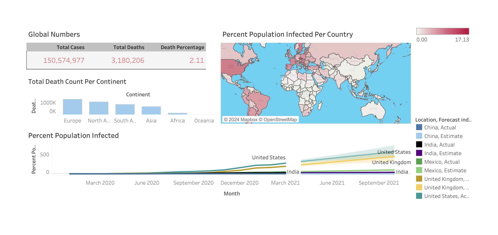

# Covid World Report

### Introduction
This project explores COVID-19 cases and deaths recorded globally from 2019 to 2021. 
By analyzing trends in infections, fatalities, and regional impacts, we aim to identify the countries and regions most affected by the pandemic. 
This project provides valuable insights into the spread of the virus, mortality rates, and other key patterns, offering a deeper understanding of the global impact of COVID-19.

### Data Sources 
The primary dataset for this analysis is **"covid_data.csv"**, containing **26 columns** and **81,573 rows** of COVID-19 records.

_***Disclaimer***_: All datasets and reports do not represent any company, institution or country, but just a dummy dataset to demonstrate my data analysis capabilities.

### Problem Statment
The analysis will focus on:

1. Global Statistics – Total COVID-19 cases, total deaths, and overall infection and mortality percentages.
2. Continental Trends – Identifying the continents with the highest and lowest infection rates.
3. Most Affected Countries – Highlighting the countries with the highest number of recorded infections.
4. Population Impact & Forecasting – Examining the percentage of the population infected and predicting potential trends if vaccines had not been developed.

### Skills/concepts demonstrated
Here are some key skills and concepts that I demonstrated using Tableau and SQL for the analyzing COVID-19 data:

#### SQL Skills & Concepts demonstrated
- Data Cleaning & Preparation –  For handling missing values, duplicates, and inconsistencies in datasets.
- Data Extraction & Transformation (ETL) – Importing, filtering, and structuring data for analysis.
- Aggregation & Grouping – Using GROUP BY, SUM(), COUNT(), etc., to calculate totals.

#### Tableau Skills & Concepts demonstrated
- Data Visualization – Creating interactive dashboards with charts, maps, and graphs.
- Time Series Analysis – Visualizing COVID-19 case trends over time.
- Geospatial Analysis – Mapping infection and death rates by country.
- Forecasting & Predictive Analysis – Using Tableau’s built-in forecasting models to predict potential cases if vaccines were not developed.

Click [Here](https://github.com/kelvin-ugwuanyi/Covid_Project_Portfolio/blob/main/PorfolioProject1.sql) for the sql queries.

## Visualization
The report is presented on a single page.

## Analysis

### Global Statistics
- Total Cases: Over 150 million recorded cases worldwide.
- Total Deaths: More than 3 million deaths.
- Global Death Rate: 2.11% mortality rate.
### Most & Least Affected Continents
- Most Affected: Europe recorded the highest number of cases, exceeding 1 million infections.
- Least Affected: Oceania had the lowest number of recorded cases.
### Countries with the Highest Infection Rates
- Most Affected Country: The United States had the highest infection rate, recording 9.77% of its population infected.
### Forecasting Without Vaccines
- If vaccines had not been developed, the United States would have been the most severely impacted, followed by the United Kingdom.

### Recommendations
- Strengthening Healthcare Systems in Highly Affected Regions. Since Europe recorded the highest number of infections, governments should invest in stronger healthcare infrastructure and pandemic preparedness strategies.
- Countries with high infection rates, such as the U.S., should continue monitoring and improving emergency response protocols for future outbreaks.
- Enhancing Vaccination Programs & Awareness. Given that forecasts indicate the U.S. and the U.K. would have been severely impacted without vaccines, authorities should continue investing in vaccination programs and public awareness campaigns to boost immunity against future variants.
- Improving Data Collection & Transparency. Standardized global reporting on infection rates, deaths, and recovery trends would help improve real-time decision-making.
- Countries with high infection rates should adopt proactive containment measures (e.g., rapid lockdowns, travel restrictions) to prevent future waves.
- Regions with lower infections (e.g., Oceania) should analyze their success factors and share best practices globally.

  
